 

  

## 🧠 Sobre mí

Soy **Juan Pablo Cabezas**, Científico de Datos y CIO.
Me especializo en la **implementación de automatizaciones e IA en organizaciones**, conectando los datos con las decisiones de negocio.
Trabajo con Machine Learning y Business Intelligence para que la tecnología resuelva problemas reales de la operación.
Me encuentras construyendo soluciones con Python, SQL, Power BI y las APIs de Claude.

## 🛠️ Tecnologías

**Lenguajes**

**Datos y BI**

**IA y Automatización**

## 🚀 Proyectos destacados

> [!IMPORTANT]
> **[TallerPractico](https://github.com/juanpablocabezas/TallerPractico)**
> <<COMPLETAR: descripción de una línea de TallerPractico>>

## 📊 Estadísticas de GitHub

<table border="0">
  <tr>
    <td></td>
    <td></td>
  </tr>
</table>

## 🏆 Trofeos

## 📫 Contacto

<a href="<<COMPLETAR: URL de LinkedIn>>"></a>

